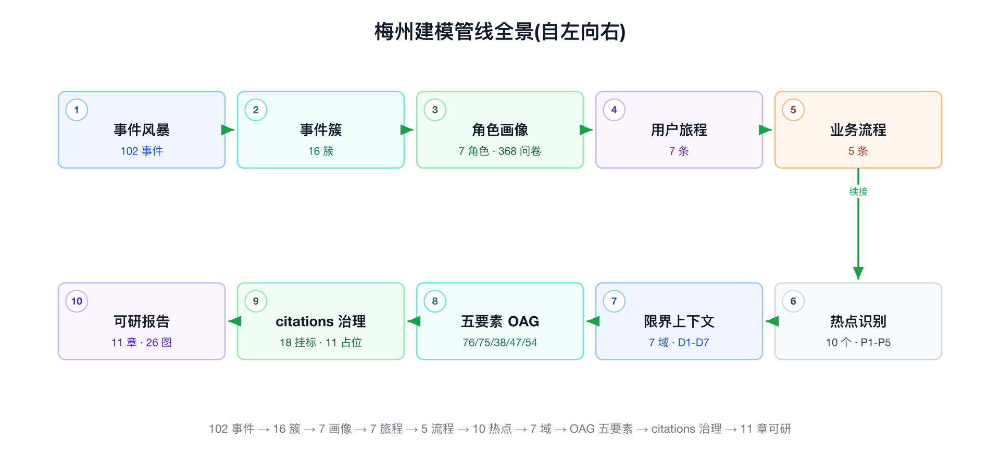
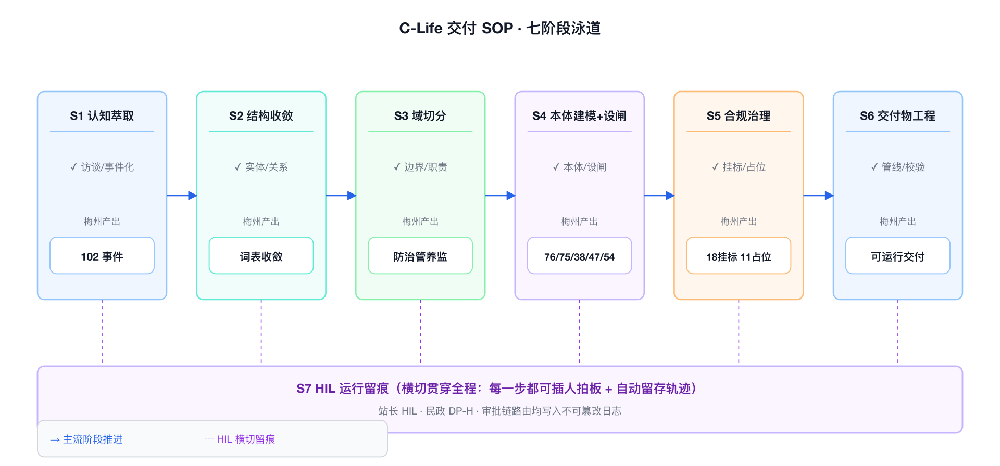
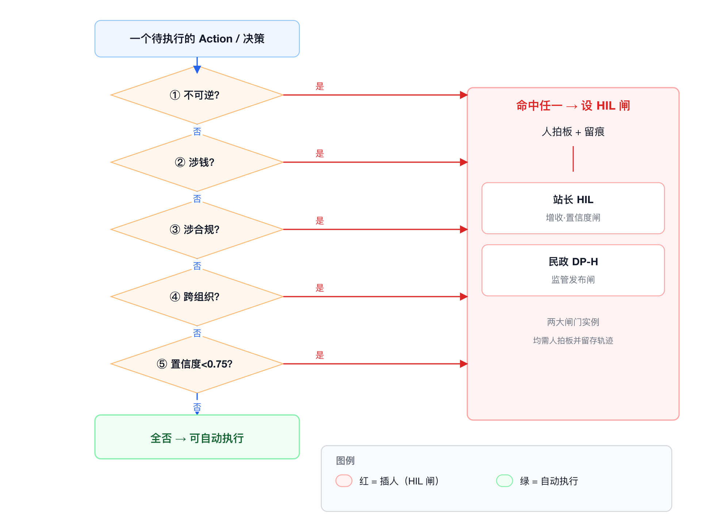

# 第 6 讲 · FDE 交付怎么做——康养项目全流程复盘

> 讲义（讲师用）· 全课程重心 · 时长 180′ · 编制遵 `_WRITING_BRIEF.md` 第六节模板
> 一句话命题：**FDE 交付不是"手艺好"，是"有 SOP + 会设闸"——SOP 保证你能重复，HIL 保证你不出事。**
> 本讲在能力模型中的位置：**主训 C3（风险设闸）、C6（交付物工程），回收 C1/C2/C4，为 C7 埋钩子。**

---

## 〇、给讲师的开场定调（讲述脚本，2′）

> "前五讲我们讲了 FDE 是什么、为什么组织需要、边界在哪、要什么知识栈、为什么离不开平台。都是'认识论'。从这一讲开始是'方法论'——**你回去要怎么干**。
>
> 这一讲是全课程最长的一讲，180 分钟，别的讲的两倍。为什么？因为这一讲要交给你两样能带走的东西：一张**七阶段交付 SOP**，套任何 To-G/To-B 项目都能用；一套**HIL 设点原则**，让你知道'在哪必须叫人、谁按、按错了赔什么'。
>
> 我先把最难听的话放在开头，省得你听半天以为我在夸 AI：**你们里面大多数人，现在能把康养项目那条链跑完，但跑不出第二遍。因为你靠的是当时的手感，不是流程。手感不能交接，流程能。这一讲就是把手感拆成流程。**"

---

## 一、时间分配（4 : 4 : 2，落到分钟）

| 段 | 占比 | 分钟 | 内容 |
|---|---|---|---|
| **认知输入（讲）** | 40% | **72′** | 开场定调 2′ → 管线全景复盘 24′ → 七阶段 SOP 18′ → HIL 设点原则（含 4.0 方法论根据）22′ → 锚定口径机制 6′ |
| **现场演练（练）** | 40% | **72′** | 导入 4′ → 个人产出交付 SOP + HIL 设点表 60′ → 两两互评 8′（详见工作坊） |
| **复盘研讨（议）** | 20% | **36′** | 3 研讨题分组 18′ → 讲师收口 12′ → 反例 B-10 复调收尾 6′ |
| 合计 | 100% | **180′** | |

认知输入 72′ 的细分：

| 时段 | 内容 | 对应本讲章节 |
|---|---|---|
| 00–02′ | 开场定调 | 〇 |
| 02–26′ | 康养项目建模管线全景逐阶段复盘（10 阶段） | 二 |
| 26–44′ | 可复用交付 SOP（七阶段泳道 + checklist） | 三 |
| 44–66′ | HIL 设点原则（**4.0 闸分两层方法论根据** + 四判据 + 一兜底闸 + 两大闸门 + 按错代价） | 四 |
| 66–72′ | 锚定口径机制（"这门课就是这么造的"） | 五 |
| —（穿插议段） | 反例主场 B-1/B-2/B-5/B-10 | 六 |

---

## 二、认知输入 1：康养项目建模管线全景逐阶段复盘（02–28′，26′）

### 2.0 这页图先立起来（板书/图）

**图 6-1  康养项目建模管线全景**
从左到右十个阶段：事件风暴 → 事件簇 → 角色画像 → 用户旅程 → 业务流程 → 热点分层 → 7 域限界上下文 → 五要素 OAG → citations 治理 → 可研报告生成。每个阶段下方标出"这一步产出什么、FDE 在这一步做什么判断"。这张图是本讲的地图，后面每讲一个阶段就点亮一格。

> **讲述脚本（定调）**："我先把整条链摊在桌上。康养项目这条链，**102 个业务事件进去，一份 100+ 页可研出来**，中间十道工序。传统模式这十道工序分给五个岗位——产品经理、架构师、行业顾问、方案经理、美工——康养项目是**1 个 FDE 带智能体编队**一条跑通。
> 但注意：我不是要你崇拜'一个人干了五个人的活'。我要你看清楚**每一道工序 FDE 到底做了什么判断**——因为那些判断，就是模型替不了、也是你回去要练的东西。模型能把每道工序做快，但**判断这道工序做完没有、做对没有，是你的活**。"

### 2.1 逐阶段拆解（每阶段：输入 / 动作 / 产出 / FDE 判断 / 踩坑）

讲师按下表逐格讲，每格约 2–2.5′。**核心不是复述产出数字，是每一格里那句"FDE 在这一步做什么判断"。**

| # | 阶段 | 输入 | 动作 | 产出 | **FDE 在这步做的判断（模型替不了）** | 容易踩的坑 |
|---|---|---|---|---|---|---|
| ① | **事件风暴** | BP + 对标医养可研样本 + 功能列表 + 6 角色视角 | 6 角色并行头脑风暴 → 合并去重 → 对照增补 | **102 业务事件**（58→39→64→102 三轮扩张） | 判断"哪些事件是真业务、哪些是想当然"；判断增补到 102 是"够了"还是"还漏了主线" | 求全癖：把能想到的都写上，事件表膨胀但没锚业务优先级 |
| ② | **事件簇** | 102 事件 | 按 C-Life 五端聚类 | **16 事件簇 A–P**；⭐E59 站长 HIL 审核 AI 方案→订单 被识别为主动增收核心 | 判断"哪个簇是营收命门"——E59 从 102 事件里被拎出来当核心，这是判断不是计算 | 平均用力：把 16 簇当同权重，没识别出 E59 这类高杠杆点 |
| ③ | **角色画像** | 16 簇 + 一手调研 | 7 画像卡 + **368 份问卷校准（310+58）** | **7 Persona**，带硬数据（居家 76% 碾压机构 / 清洁 82.76% 应急 81% 付费意愿 / 熟人获客 77.59% / 入住触发=失能 46.55%） | 判断"画像是拍脑袋还是有数据背书"——368 份问卷是把画像从'我觉得'钉成'数据显示' | 画像文学化：写得像人物小传，但没有一个数字能支撑定价/获客决策 |
| ④ | **用户旅程** | 7 画像 | 7 条旅程，阶段轴扣双闭环 | **7 旅程**，涌现 ~30 候选 skill → 聚为 C1–C11 能力簇 | 判断"旅程服务谁"——长者旅程初版做'夜间急救'（过重），FDE 砍掉改为营收复购飞轮（见反例 B-7） | **过度建模**：把旅程做全、做重，偏离营收主线，返工（B-7 的坑就在这一格） |
| ⑤ | **业务流程** | 7 旅程 | 5 条跨角色流程建模，决策点=skill 边界 | **5 流程**（会员飞轮 / 洞察→HIL→分账 / 三元结算 / 补贴事前拦截 / 失能转介） | 判断"决策点在哪切"——每个决策点就是一个未来的 skill 边界，切错了域就划错 | 决策点识别不全：流程画成直线，漏掉分叉，后面域边界就糊 |
| ⑥ | **热点分层** | 102 事件 + 7 画像 + 7 旅程 + 5 流程 | 综合排名 | **10 热点，P1–P5 分层**（HS-1 站长 HIL 增收为首、HS-2 结算中台） | 判断"先建什么"——P1–P5 就是建设次序，也是投资优先级，这是商业判断不是技术判断 | 技术视角排序：按'好实现'排而不是按'business value'排 |
| ⑦ | **7 域限界上下文** | 10 热点 + domain-canvas + behavior-matrix | 聚域 → 画边界 → 定承重关系 | **7 域 D1–D7**；承重主脊 5 条；建设次序 P1（D7→D1→D2）→P5（D6） | 判断"域怎么切、谁 canonical"——Elder 共享根定在 D4 单写入、结算真相源定在 D2，这是**架构宪法级**判断 | 越域冲动：想让一个域直接写另一个域的对象（B-8 的坑，第 5 讲主讲） |
| ⑧ | **五要素 OAG** | 7 域边界 | 每域编译成 clife-onto-engine 五要素插件 | **Object 76 / Link 75 / Function 38 / Rule 47 / Action 54 / HIL 26**；3835 行骨架 + 21 YAML；7/7 py_compile ✓ | 判断"哪个 Action 要设闸"——26 个 HIL 就是在这一步一个一个点上去的（本讲第四章主讲） | 漏设闸 / 滥设闸：该设的没设（橡皮图章隐患）、不该设的乱设（拖慢链路） |
| ⑨ | **citations 治理** | 47 条 Rule | 逐条挂标准/法规文号，核到官方现行版 | **18 处挂已核验国标**；**11 处坚决保留占位不编造**转取证清单 | 判断"这个文号我能不能核实"——查不到就留 `[本地待补文号]`，不编（本讲反例 B-10 主场） | 编造文号 / 张冠李戴：把'看起来像国标'的当国标（B-6，第 4 讲）；数据错配（B-5） |
| ⑩ | **可研报告生成** | 7 域成果 + 5 份客户材料 | 锚定口径 → 35 节并行写作 → 装配 → 质检 | **11 章 / ~11 万字 / 26 图 + 2 附录 docx** | 判断"口径怎么统一"——靠 `_WRITING_BRIEF.md` 单点锚定，不靠 35 个作者自觉（本讲第五章主讲） | 计数漂移 / 编号冲突：并行产出不收口（B-1）、编号权没归装配（B-2） |

> **讲述脚本（收这一章）**："看完这十格，记住一句话：**模型帮你把每一格做快了，但每一格里那句加粗的'FDE 判断'，没有一个是模型替你做的。**102 事件聚成 16 簇——聚类模型能做，但'E59 是营收命门'这个判断是人做的。7 域切分——模型能给你候选，但'Elder 根定在 D4'这个宪法级决定是人拍的。**你的核心资产不是会调这些工具，是会在每一格做那个判断。这就是第一讲那句话的实证：FDE 的核心资产是把模糊意图压成可执行结构。**"

---

## 三、认知输入 2：可复用交付 SOP（七阶段泳道，28–48′，20′）

### 3.0 从"康养项目十阶段"抽象到"通用七阶段"（讲述脚本）

> "上面十格是康养项目**具体**长什么样。但你回去做的不是康养项目，是别的项目。所以我把这十格抽象成**不依赖康养项目、套任何 To-G/To-B 项目都能用的七阶段**。十格是实例，七阶段是模板。**记模板，别记实例。**"

**十阶段 → 七阶段映射：**
- 阶段①②③ → **S1 认知萃取**（事件风暴+画像）
- 阶段④⑤⑥ → **S2 结构收敛**（旅程+流程+热点分层）
- 阶段⑦ → **S3 域切分**（限界上下文）
- 阶段⑧ → **S4 本体建模 + 设闸**（五要素 + HIL）
- 阶段⑨ → **S5 合规治理**（citations + 取证清单）
- 阶段⑩ → **S6 交付物工程**（锚定口径 + 并行写作 + 装配质检）
- 贯穿全程 → **S7 HIL 运行与留痕**（不是一个阶段，是横切纪律）

### 3.1 七阶段泳道图（板书/图）

**图 6-3  FDE 交付 SOP 七阶段泳道**
横向七道泳道 S1–S7，每道标出【输入 → FDE 动作 → 智能体动作 → 产出 → HIL 闸】。S7（HIL 运行与留痕）画成横贯所有泳道的底轨，强调它不是一个阶段而是贯穿全程的纪律。每两道泳道之间画一道"收口闸"，标明"这一阶段没收口不许进下一阶段"。

### 3.2 七阶段 checklist（学员现场演练要照这个填自己的项目）

> **讲述脚本**："下面每个阶段我给一张 checklist。这不是给你看的，是给你**用**的——你回去起一个新项目，就照这七张单子逐条打勾。打不了勾的，就是你这个项目还没准备好进下一阶段。"

**S1 认知萃取**（对应康养项目 102 事件/7 画像/368 问卷）
- [ ] 是否至少 3 个角色视角并行做过事件风暴？（康养项目是 6 角色）
- [ ] 事件是否经过"合并去重 → 对照增补"两轮以上？（康养项目 58→39→64→102）
- [ ] 画像是否有**一手数据校准**，不是拍脑袋？（康养项目 368 份问卷）
- [ ] 是否已识别出"营收/价值命门事件"？（康养项目 E59）
- ⚠️ 收口标准：**事件集可归域**——每个事件都能预判归到哪个域，否则回炉

**S2 结构收敛**（对应康养项目 7 旅程/5 流程/10 热点）
- [ ] 旅程是否服务于业务优先级，而非求全？（B-7 教训：砍掉过重的夜间急救）
- [ ] 流程的每个决策点是否已标记为"未来 skill 边界"？
- [ ] 热点是否按 **business value** 分层（P1–P5），而非按实现难度？
- ⚠️ 收口标准：**有一份 P1–P5 优先级表**，且客户认可这个次序

**S3 域切分**（对应康养项目 7 域 D1–D7）
- [ ] 每个域的职责能否用 1–2 句说清？说不清就是切错了
- [ ] 共享根实体（如康养项目 Elder）是否**指定唯一 canonical 域**？
- [ ] 是否有"记账/结算真相源"这类单点权威域？（康养项目 D2）
- [ ] 跨域关系是否只有 ref/发布，**没有越域直写**？（B-8）
- ⚠️ 收口标准：**承重关系图零悬空引用**（康养项目 A 结构 7/7）

**S4 本体建模 + 设闸**（对应康养项目五要素 76/75/38/47/54 + HIL 26）
- [ ] 五要素是否齐全（Object/Link/Function/Rule/Action）？
- [ ] **每个 Action 是否都过了一遍 HIL 四判据**（第四章）？
- [ ] 高杠杆/高风险 Action 是否设了闸并指定"谁按"？（康养项目 26 处）
- [ ] 结构是否 py_compile / 校验通过？（康养项目 7/7）
- ⚠️ 收口标准：**HIL 设点表成型**，每个闸有判据依据 + 责任人

**S5 合规治理**（对应康养项目 18 挂国标 / 11 占位）
- [ ] 每条硬规则是否挂了 source/citations？（康养项目 0 空 source，B 治理 7/7）
- [ ] 文号是否**核到官方现行版本**？（B-6 教训：别把像国标的当国标）
- [ ] 查不到的文号是否**留占位不编造**，并转成取证清单？（B-10）
- ⚠️ 收口标准：**一份可交现场的"待补取证清单"**（康养项目 11 处逐项列谁去取）

**S6 交付物工程**（对应康养项目 11 章/11 万字/26 图）
- [ ] 是否有单一锚定口径文件（BRIEF）？术语/数据/口径单点定义？
- [ ] 并行写作是否**只引用不重算**关键数字？（B-5）
- [ ] 编号权是否归装配阶段，不归写作阶段？（B-2）
- [ ] 图目/摘要是否有"收口回改"动作，防计数漂移？（B-1）
- ⚠️ 收口标准：**装配后质检零口径冲突、零断链、零计数漂移**

**S7 HIL 运行与留痕**（横切，非阶段）
- [ ] 每个闸是否"AI 研判 + 人拍板 + 写后留痕"三段齐全？
- [ ] 置信度闸阈值是否明确（哪怕是占位，如康养项目 0.75）？
- [ ] 责任是否落到具体岗位（站长/民政经办），不是"系统"？
- ⚠️ 收口标准：**任何一次自动决策都能追溯到"谁在什么置信度下拍的板"**

> **讲述脚本（收这一章）**："七张单子，最后一句话：**SOP 的价值不在'告诉你做什么'，在'告诉你什么时候还没做完'。**每张单子最后那行加粗的'收口标准'才是灵魂。康养项目能一个人跑通，不是因为那个人聪明，是因为**每一阶段都有明确的收口标准，跑到哪一步、还差什么，是可视的，不是靠感觉的。**这就是第五讲那句话：平台是方法论的固化物，SOP 是方法论的可视化。"

---

## 四、认知输入 3：HIL 设点原则（本讲灵魂，44–66′，22′）

> **讲述脚本（郑重定调）**："这一章是全课程的命门。前面讲的都是'怎么把活干出来'，这一章讲'怎么让活别把你干进去'。
> 一句话：**FDE 交付的专业性，一半在'把结构建出来'，另一半在'知道自己在哪必须叫人'。**建结构建错了，返工；该叫人没叫人，出事。返工赔时间，出事赔的是钱、是合规、是客户关系——**有些是不可逆的。**"

### 4.0 先立方法论根据：闸分两层——自动闸（引擎回滚）+ 人工闸（HIL）（参照 `reference/methodology 05/09/23`）

> **讲述脚本（务必先讲这一段，否则学员会把 HIL 当成"唯一的闸"）**："设 HIL 之前，先搞清一件事——**闸有两层，HIL 只是第二层。** 我们自己的方法论文集（`clife-onto-engine · reference/methodology`）把这件事讲透了，我给你搬三条硬结论。

**① 软约束不是工程约束（方法论 09）。** 你在提示词里写'发起采购前必须检查认证有效期'——这是**软约束**，有三个结构性缺陷：**会被遗忘**（多轮对话后早期指令权重下降）、**会被稀释**（上下文塞满后约束被挤出）、**会被绕过**（提示词注入让模型"忘记"约束）。**"自觉遵守不是工程约束。"** 三层强度对比记住：

| 层次 | 机制 | 强度 | 可绕过性 |
|---|---|---|---|
| 提示词层 | 靠 LLM 自觉 | 最弱 | 高（注入即破） |
| API 网关层 | 校验请求参数格式 | 中 | 中（参数可伪造） |
| **本体层** | 校验业务状态 + 全局不变式 | **最强** | **低（引擎强制，无旁路）** |

**② 第一层是"自动闸"——引擎确定性回滚，机器把关（方法论 09）。** 本体层的 Rule 是"违反就拦截 + 回滚"：前置条件通过 → 内存中变更 → 全局规则命中（如"认证剩 13 天 < 30 天"）→ **回滚，记录从未被写**。Agent 收到的不是 500 错误，而是**结构化拒绝**三件套：`triggered_rule`（为什么不行）+ `current_state`（当时世界快照）+ `suggestion`（可以怎么调整）→ Agent 据 suggestion 改选、重试成功。这就是 **OAG 闭环：发现 → 调用 → 被拒 → 调整 → 重试**，全程在约束内、没绕过。**能固化成硬规则的，就交给自动闸，别浪费人力。**

**③ 第二层才是"人工闸"——HIL，人拍板（方法论 23 置信度总线）。** 那什么时候上 HIL？两种：**一是机器判不了的价值判断**（涉钱/涉合规/跨组织的拍板）；**二是机器"没把握"**——AI 原生系统里每个断言都是概率的（`balance_sufficient = (False, confidence=0.78)`），**置信度太低（接近随机）时，基于它的决策不该是最终结论，必须触发人工复核**。这就是康养项目**站长置信度闸 0.75** 的方法论根据：不是拍脑袋定的阈值，是"低置信必须转人"的工程共识。

**④ HIL 留痕 = 审计快照，不是日志（方法论 05/10）。** HIL 按完要留痕，留的不是"操作日志"，是**决策快照**——"记录上下文，而不只是记录结果"。康养项目 `HILReview` 强制留 `signer_id / reviewed_at / decision / edits_before_after`，就是为了回答方法论 10 那个问题：**"三个月后，合规团队问'AI 当时凭什么觉得能下单'，你能不能当天答上来。"**

> **一句话收口（方法论 09 金句，直接板书）**："**你能把多大的权力交给一个系统，取决于设计时边界定义在哪里，以及越界时——是被它自己拦下，还是被现实拦下。**" 自动闸 + HIL，就是"被它自己拦下"；两样都没设，就是等着"被现实拦下"——那时赔的是钱、是合规、是客户关系。**下面讲的四判据，是帮你决定"这道闸该自动、还是该上人"。**

### 4.1 四条硬判据 + 一条置信度兜底闸（板书/图）

**图 6-2  HIL 闸门设点决策树**
一个 Action 从顶端进入，依次过四个判断菱形——不可逆？涉钱？涉合规？跨组织？——**命中任一即落到"必须设 HIL 闸"**；四个都不命中的，再过第五道"置信度兜底闸"——模型置信度低于阈值同样落人工。全不命中且高置信度，才允许全自动。决策树末端标注两条康养项目实例路径：E59（涉钱+跨组织→站长 HIL）、补贴发布（涉合规+涉钱→民政 DP-H）。

**HIL 设点四判据（满足任一即须插人）：**

| 判据 | 含义 | 一句话测试 | 康养项目实例 |
|---|---|---|---|
| **① 不可逆** | 动作做了收不回来 | "撤销这个动作，代价大到不可接受吗？" | 急救四级联动升级（D4，误升级/漏升级都不可逆）、监管数据对外发布（D6） |
| **② 涉钱** | 动作直接产生/改变金钱流向 | "这一步之后有钱动了吗？" | 增收订单生成（D1→D3，E59）、DIP 结算入账（D2）、补贴拨付（D6） |
| **③ 涉合规** | 动作触发监管/法律义务 | "监管来查，这一步要留痕解释吗？" | 数据授权/最小必要（D6）、DIP 控费入账前阻断（D2） |
| **④ 跨组织** | 动作的后果落到别的主体身上 | "做错了，是别人替我承担后果吗？" | AI 方案转订单卖给会员（跨到客户）、补贴发布（跨到政府监管） |

**⑤ 置信度兜底闸（第五条，横切覆盖前四条之外的情形）：**
- 前四条判据是"看动作性质"；第五条是"看模型有多确定"。
- **即便一个动作四条都不命中，只要模型对它的置信度低于阈值，同样落人工。**
- 康养项目把这条固化为 D1 的**置信度闸**：`hard · function · pre`，阈值占位 **0.75**（待定口径），**建模时刻意设成 pre（前置）**——在动作发生前拦，不是发生后补。
- 这条是防"高频低置信"决策悄悄溜过去的最后一道网。

> **讲述脚本**："为什么是'满足任一即插人'，不是'满足多数'？因为这四条每一条单独成立就够伤。**涉钱一条就够了**——一笔错误增收决策，客户的钱亏了，赖不到模型头上，赖到你头上。所以是'任一'，是**或**，不是**与**。宁可多设几道闸拖慢一点，不可漏一道闸出一次事。"

### 4.2 用 26 个 HIL 点做实证（板书）

康养项目 7 域 **26 个 HIL 点**的分布，就是四判据的实证：

| 域 | HIL 数 | 为什么这么多/这么少（判据实证） |
|---|---|---|
| D1 kangyang-agent-core | **2** | 站长 HIL（增收，涉钱+跨组织）+ 健管师复核；增收链路是营收命门，必须人拍板 |
| D2 policy-settlement-hub | **0\*** | 注意这个星号——**结算域 0 个显式 HIL，但有 4 处"经办拍板"注释**。为什么？因为 D2 是记账真相源，它的合规拦截做在**规则前置**（DIP 双拦截、反重复），把关口挪到规则层而非人工层；但涉钱涉合规，仍留 4 处人工拍板痕迹 |
| D3 member-revenue-flywheel | **1** | 营收飞轮，涉钱但多为可逆营销动作，只在关键转化点设 1 闸 |
| D4 home-care-health | **6** | 最多之一——含**急救四级联动指挥**（不可逆！），监测/派单/评估多处涉人身安全 |
| D5 institution-ops | **5** | 机构运营，入住/退费/医嘱涉钱涉合规涉人身 |
| D6 civil-affairs-govern | **8** | **最多**——民政治理，DP-H 闸（监管发布，涉合规+涉钱+跨组织三条全中）、补贴事前拦截、数据授权，几乎每个 Action 都踩判据 |
| D7 kangyang-llm-kb | **4** | 知识库版本发布，被全域引用，发错版本影响全局，故版本发布设闸 |
| **合计** | **26** | 分布不是均匀的——**风险在哪，闸就在哪**。D6 有 8 个不是因为它复杂，是因为它每个动作都涉合规涉钱跨组织 |

> **讲述脚本**："看这张表最该学的是 **D2 那个星号**。D2 是结算域，涉钱最狠，但它显式 HIL 是 0。新手会觉得矛盾——涉钱怎么不设闸？因为 FDE 做了个更高级的判断：**把合规拦截前置到规则层（DIP 双拦截、反重复引擎），比事后拉个人来点确认更可靠。**人工闸是最后手段，不是唯一手段。能用确定性规则挡住的，就别靠人肉点确认——人肉点确认点多了，就变成橡皮图章。这就引出下面最要命的东西。"

### 4.3 两大闸门 + 按错的代价（本章高潮，板书）

**闸门①：站长 HIL（增收闸 · 置信度闸 0.75 防橡皮图章）**

- **机制**：六智能体链路（洞察→根因→需求→方案→⭐HIL→执行→评估→回流），AI 生成增收方案后，**必须站长在审核台点确认才能转成订单**（E59）。
- **判据命中**：涉钱（生成订单）+ 跨组织（卖给会员/长者）+ 置信度兜底（0.75 闸）。
- **为什么设置信度闸**：不是走个形式让站长点"同意"。建模时把它设成 `hard·function·pre`，**目的就是防橡皮图章**——AI 高置信的方案快速过、低置信的方案强制站长细看。
- **⚠️ 按错的代价（具体场景）**：
  - **场景 A：置信闸形同虚设 → 橡皮图章 → 错误增收决策。** 如果把 0.75 阈值调成 0（或站长养成'一律点同意'的习惯），闸门在，但等于没有。AI 给一个低置信的、对长者不合适的高价套包，站长机械点过，卖出去了——**这是涉钱+跨组织双命中的动作出错，钱是长者的、口碑是客户的、责任是 C-Life 的。** 微康养做的是熟人生意（康养项目熟人获客 77.59%），卖错一单，毁的是整个片区的信任飞轮。
  - **根因原则**：**闸门的价值不在'有没有',在'会不会真拦'。置信度闸就是防止 HIL 退化成盖章仪式的技术保险。阈值是活的，谁调阈值谁负责。**

**闸门②：民政 DP-H（监管发布闸）**

- **机制**：D6 民政治理域，`DPHReview` human_gate——**任何对外发布的监管数据/补贴决定，必须民政经办拍板留痕**。
- **判据命中**：涉合规 + 涉钱（补贴）+ 跨组织（政府对社会发布），**三条全中**，是全项目判据命中最密的闸。
- **⚠️ 按错的代价（具体场景）**：
  - **场景 B：DP-H 失守 → 违规发布监管数据。** 如果监管发布不过人工闸，AI 把一份未经核验的床位一张图、或一笔补贴资格认定直接对外发布——**违反数据授权最小必要（个保法）、可能错发/漏发补贴（涉公帑）、政府信用受损。** 这是不可逆的：数据发出去了，收不回来；补贴发错了，追缴是政治事件。
  - **根因原则**：**跨组织 + 涉合规的动作，人工闸是法律义务不是可选项。谁发布谁签字，签字的人为这条数据的真实性背书。**

> **讲述脚本（收这一章，加重）**："两个闸门，两句话记住：
> **站长闸防的是'钱按错'——闸门在但退化成橡皮图章，等于没有，置信度闸就是防这个的。**
> **民政闸防的是'合规越界'——跨组织发布是法律义务，谁签字谁背书。**
> 你回去设闸，就问这五个问题：不可逆吗？涉钱吗？涉合规吗？跨组织吗？模型够确定吗？**中一条，插人。别嫌麻烦——嫌麻烦的代价，你赔不起。**"

---

## 五、认知输入 4：锚定口径机制（"这门课就是这么造的"，66–72′，6′）

> **讲述脚本（元层面，故意点破）**："最后 6 分钟讲一个你们现在正泡在里面的东西。
> S6 阶段那张单子第一条：'是否有单一锚定口径文件？'康养项目的可研报告，**11 章、11 万字、35 个分节，是拆给多个子智能体并行写的**。并行写作最大的风险是什么？**口径漂移**——张三写的老龄化率用 60+ 口径，李四用 65+ 口径，装配起来数字打架（这就是反例 B-5）。
> 康养项目怎么防的？一份 `可研报告/_WRITING_BRIEF.md`。它做三件事：
> 1. **术语统一表**——'数智本体'不许写成'知识本体'，锁死写法；
> 2. **核心数据表（唯一真相源）**——76/75/38/47/54、1.36 亿、IRR 15.2%，**所有分节一律引用不重算**；
> 3. **锚定事实 + 协作纪律**——把'嘉城数联合资公司/合资口径 IRR 15.2%（第 9 年回本）'这类主体与效益口径钉死在一处，任何口径若要调整，只改这一处、全篇自动跟，绝不允许分节作者各写各的。
>
> **关键机制：口径不靠 35 个作者自觉对齐，靠一份单点文件强制对齐。作者只写自己那节、只引不算、编号权归装配。**
>
> 现在最元的一句话——**你们现在读的这门课，就是这么造的。**你手上这份讲义，和另外九讲，是拆给多个写作子智能体并行写的，共用一份 `tutorial/FDE课程/_WRITING_BRIEF.md`，结构和康养项目那份一模一样：术语统一表、核心数据表、反例分配表、协作纪律。**这门课本身就是一次 FDE 交付，用的就是这一讲教你的 SOP。教材的生产方式，就是教材的内容。**这不是巧合，是刻意示范。"

板书一句话收口：**"多智能体一致性靠锚定口径，不靠自觉。这是 C6 的核心，也是这门课的元证据。"**

---

## 五·补 认知输入 5：SOP 跨交付模式通用（72–78′，6′）

> **讲述脚本**："最后把这套 SOP 从康养项目里拎出来，问一句：它只在康养、只在'大平台'这种模式成立吗？不是。这七阶段**跨交付模式通用**——不管你做的是模式一的 Token-SaaS 应用，还是模式二的大平台建设，阶段一样，变的是内容和轻重。给你们看四个对照——
> **① SOP 可以在任意阶段停。** **辣椒大模型**（模式二）现在到 **S3–S4 纸面**：出了 1500 行建设方案、画了三层本体设计，但**没编译落地**，plugins 和 demo 还是空的。交付物就是这份方案——这不是没做完，是**这个阶段就该交这个**。SOP 的价值就是：你随时知道自己在第几阶段、手里该拿出什么。
> **② 同一套管线跨模式、跨行业不变。** **教育督导项目**是模式一的 Token-SaaS 应用，但它用的是**和康养项目一字不改的建模管线**：event-storm（33 事件）→ 画像（李科长/张园长/王老师三层）→ domain-map（2 插件 13 skill）→ opportunity。模式变了、行业变了，方法没变，变的只是领域知识：医保 DIP 换成 6×23×59×约150 条评估细则。
> **③ HIL 命门随交付模式迁移，但四条判据不变。** 模式二的康养项目，命门是**站长增收闸**（涉钱）+ **民政 DP-H 发布闸**（涉合规+不可逆）。模式一的教育督导项目，没有增收盘，命门是**三处应用内裁定闸**：区局 OKR 审核、园长材料复核、警告下强制提交——全涉合规、不可逆，一个增收闸都没有。农业口的草业项目/辣椒，命门又迁到**碳汇/溯源凭证发布闸**。**看到没：闸门位置从'增收'挪到'应用内质检'再挪到'凭证发布'，但判据永远是那四条。**
> **④ 顺便两个真坑，都是诚实课。** 一，该区园所数源里有三个——99 所 / 124 园 / 79 样本，**我不替它选一个，因为口径没核实**（B-5 活体）。二，草业项目那个能点开的 11 页 demo，**AI 是 Mock 的关键词路由、不是真模型**——演示时我一定说'这是交互外壳、不是模型跑通'，把 demo 吹成产品就是骗客户。（四案例详见《FDE 交付模式矩阵》）"

**板书**：七阶段跨模式通用 → 辣椒方案🟡 / 草业项目方案+Mock demo🟡 / 教育督导项目建模+方案🟢 / 康养项目编译交付🟢；HIL 命门：增收闸→应用内质检闸→凭证闸迁移，**四判据恒定**；该区园数 99/124/79 待核、草业项目 demo=Mock（双诚实点）。

---

## 六、反例主场（贯穿议段，本讲分配 B-1 / B-2 / B-5 / B-10）

> **讲述脚本（定调）**："别的讲一讲一个反例，这一讲是**反例主场**，一次给你四个。因为交付物工程和合规治理是出错高发区，这四个坑我们全踩过。每个反例讲三件事：**怎么发生的、怎么被发现的、根因是什么原则。**"

### 反例 B-1：图目计数漂移

- **怎么发生的**：`_FIG_SPECS.md` 的标题写"22 张图"，但表体实际列了 **26 行**。后期补的 5-3、5-4、A-1 等图追加到表尾，**头部那个计数没人回去改**。
- **怎么被发现的**：质检阶段核对"标题说 22、表里数出来 26"，对不上。
- **根因原则**：**摘要与明细必须有单一真相源；并行/追加式产出必须有一个显式的"收口回改"动作。** 漂移不是因为谁粗心，是因为**没有一步流程负责在追加后回改头部计数**。对应 SOP 的 S6 收口标准。

### 反例 B-2：章节编号冲突

- **怎么发生的**：35 个分节**并行**写作，各节作者自行起标题层级和编号，装配期出现**编号重复 / 跳号**。
- **怎么被发现的**：装配合并时编号撞车。
- **根因原则**：**编号权归装配阶段，不归写作阶段。**（`_PLAN.md` 已固化此纪律。）写作时只管写内容，编号是装配时统一分配的——**并行的东西，全局唯一性只能在收拢点解决，不能指望各分支自己协调。** 对应 S6 checklist"编号权归装配"。

### 反例 B-5：数据张冠李戴（老龄化率）

- **怎么发生的**：县区七普老龄化率在跨节引用中错配——**60+ 口径和 65+ 口径混用**，同一个指标两个节写出两个数。
- **怎么被发现的**：交叉核对同一指标在不同章节的值，发现口径不一致。
- **根因原则**：**关键数字必须锚在 BRIEF 单点，分节作者一律引用不重算。** 这正是第五章讲的锚定口径机制的**反面**——BRIEF 核心数据表存在的全部意义，就是防 B-5。（本反例第 4 讲也讲，第 4 讲讲"标准/数据核验"，本讲讲"并行写作的口径收口",同一坑两个视角。）

### 反例 B-10：11 处地方文号坚决不编造（全课程价值观支点，议段压轴）

- **怎么发生的**：citations 治理时，7 处本地文号（康养项目 DIP 细则、助餐补贴办法、政府购买清单等）+ 4 处企业内部 SOP 编号，**公开渠道查不到**。
- **诱惑在哪**：编一个"看起来对"的文号，合规件就完整了，交付显得漂亮。
- **FDE 怎么处理的**：**11 处坚决保留 `[本地待补文号]` / `[企业标准,FDE 补编号]` 占位不编造**，每处锚定上位国标（如康养项目 DIP 细则锚 医保办发〔2020〕50号），转成一份**向某市医保局/民政局/政数局逐项取件的清单**（`FDE-citations-待补清单.md`），标注"该找谁、取哪份文件"。**判定为非 BLOCKER，不阻断交付。**
- **根因原则（原话直引）**：

> **"错文号比空缺更有害。"**

- 讲师收口：**"这是全课程的价值观支点，出现三次不是重复，是复调（第 3、6、9 讲各一次）。FDE 的专业性，一半体现在敢说'我不知道'。空缺是诚实的，能被后续补上；错误的文号是有毒的，它会以'看起来完整'的样子骗过审核，在迎检时爆炸。留占位 + 锚上位国标 + 转取证清单，这套动作就是把'不知道'变成'专业的不知道'。"**

---

## 七、现场演练导入（练段开场，4′）

> **讲述脚本**："讲完了。现在轮到你。接下来 72 分钟，你要产出**两样东西**，就是你今天能带走的资产：
> **① 你自己一个项目（自选或我指定）的交付 SOP**——套今天这七阶段，每阶段填你项目的具体内容 + 收口标准；
> **② 一张 HIL 设点表**——把你项目里所有需要插人的决策点列出来，每个标：命中哪条判据、谁按、按错的代价是什么。
>
> 别贪多。SOP 七阶段每阶段两三句，HIL 表能列出 5–8 个真闸就是合格线。**我评的不是你写得多，是你有没有在'该设闸的地方设了闸、说清了按错的代价'。**具体材料、模板、评分卡在工作坊文件里，翻开开始。"

（详细输入材料、步骤、模板、评分卡见 `工作坊/06_FDE交付怎么做_康养项目全流程复盘_workshop.md`）

---

## 八、复盘研讨（议段，36′）

分组讨论 18′（每题 6′）→ 讲师收口 12′ → B-10 复调收尾 6′。

**研讨题 1（设闸判断）**："在你的 HIL 设点表里，有没有一个决策点是'四判据都不太命中，但你还是设了闸'的？为什么？如果一个都没有，是不是你把置信度兜底闸忘了？"
> 收口话术：好的 FDE 会为"高频低置信"动作设兜底闸，这是四判据之外最容易漏的一类——康养项目的 0.75 置信闸就是干这个的。

**研讨题 2（橡皮图章）**："假设你表里某个闸，责任人每次都点'同意'。这个闸还有用吗？你怎么从机制上防止它退化成橡皮图章？"
> 收口话术：闸门的价值不在"有没有"，在"会不会真拦"。答案指向置信度闸/抽检/留痕追责——康养项目站长闸设 `hard·pre` + 0.75 阈值就是防退化的技术保险。

**研讨题 3（诚实边界）**："你的项目里有没有'查不到、核不实'的文号/数据/标准？你打算编一个让交付显得完整，还是留占位转取证清单？说出你会怎么跟客户解释这个空缺。"
> 收口话术：回收 B-10。"错文号比空缺更有害"。能对客户坦然说"这处我留了占位、给你一份取件清单"的 FDE，比交一份"看起来完整"的假件的 FDE 专业得多。

**讲师收口（12′）**：回到本讲命题——"FDE 交付不是手艺好，是有 SOP + 会设闸。SOP 保证你能重复，HIL 保证你不出事。今天你带走了这两样，就不再是'跑通过一次康养项目'，而是'能跑第二遍、第三遍、别的项目也能跑'的人。"

---

## 九、本讲难听话（1 句）

> **"你现在能把康养项目那条链跑完，靠的是当时的手感——但手感不能交接，也不能背锅。真正值钱的不是'你会干',是'你知道在哪必须停下来叫人',以及'你敢在查不到的地方留个空、而不是编一个'。前者让你跑得快，后者让你活得久。多数人栽,不栽在不会干,栽在该叫人的时候逞能、该说不知道的时候硬编。"**

---

## 十、与其他讲的钩子

- **← 第 1 讲**：本讲逐格复盘印证第 1 讲"客户要结果、组织给工序"；反例 B-7（旅程过重返工）在第 1 讲首讲，本讲在阶段④回收。
- **← 第 4 讲**：反例 B-5（数据张冠李戴）第 4 讲从"数据核验"讲、本讲从"并行口径收口"讲，同坑两视角；B-6（标准号误标）是本讲阶段⑨的前车之鉴。
- **← 第 4 讲（本体栈方法论）**：本讲 4.0 的"闸分两层（自动闸 + HIL）"直接建在第 4 讲栈③的 OAG 方法论上——`clife-onto-engine` 的 Rule 确定性回滚 = 自动闸、置信度总线 = 站长 0.75 闸；本讲 S1–S4 的阶段划分呼应方法论 `03` 的四阶段（调研建模 → 数据治理 → 引擎搭建 → 场景验证）。深读见 `reference/methodology 05/09/23/10`。
- **← 第 5 讲**：本讲 S3/S4 的"零悬空引用、不越域"直接用第 5 讲的平台校验能力；B-8（越域写入）在第 5 讲主讲，本讲阶段⑦点名。
- **→ 第 7 讲**：本讲讲"SOP 是什么"，第 7 讲讲"Astra Studio 各插件怎么咬合把 SOP 跑起来"；反例 B-3/B-4（图片路径/主题色）是本讲 S6 交付物工程的下游延续。
- **→ 第 8 讲**：本讲 HIL 设点是 C3 能力，第 8 讲讲"什么样的人做得了这个判断"——C7（价值判断/责任承担）只能筛选不能训练，本讲的"敢留占位、敢叫人"就是 C7 的现场表现。
- **→ 第 9 讲**：B-10 在第 9 讲第三次出现，对标 Palantir 的"现场取证文化"——同一诚实原则的外部印证。

---

_本讲配图占位：fig-6-1-康养项目管线（管线全景）、fig-6-2-HIL决策树（设点决策树）、fig-6-3-交付SOP（七阶段泳道）。slug 遵总纲 figures 表，先定后画（防 B-3），不自造。_
